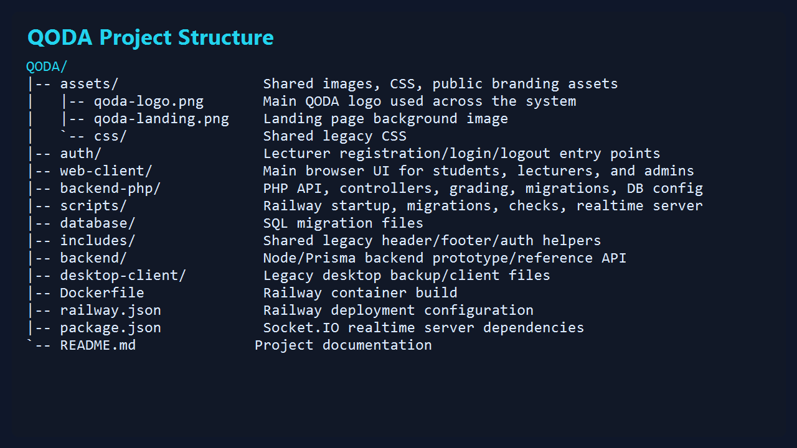
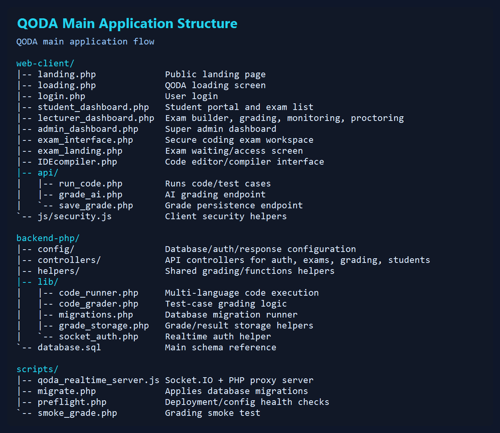

# QODA PU

QODA PU is a secure coding examination platform for creating, publishing, monitoring, grading, and reviewing programming exams. It supports lecturer exam building, student exam delivery, browser-based coding, test-case grading, live proctoring, realtime screen monitoring, score sheets, and deployment on Railway.

Live app: [https://qoda-production.up.railway.app](https://qoda-production.up.railway.app)

Repository: [https://github.com/vwkichasu-lab/qodavictor](https://github.com/vwkichasu-lab/qodavictor)

## Project Structure





## Main Features

- Lecturer dashboard for exam creation, publishing, grading, monitoring, and student management.
- Student dashboard for viewing available exams, starting exams, and reviewing results.
- Secure coding exam interface with timer, save, submit, compiler panel, starter code, and question navigation.
- Multi-language code execution and grading support through PHP, Node.js, Python, Java, C/C++, .NET, and related runtime tooling.
- Test-case based grading with model solutions, marking schemes, and score storage.
- Live proctoring tools with screen-sharing status, violations, locks, warnings, and evidence workflow.
- Realtime Socket.IO server for live monitoring, exam control messages, and screen-share signaling.
- Railway deployment with Docker-based build and startup migration support.
- MySQL database schema and migration files for repeatable setup.

## Technology Stack

- PHP 8.3
- MySQL / MariaDB
- JavaScript, HTML, CSS
- Node.js
- Socket.IO
- Monaco Editor
- Docker
- Railway

## Main Folders

```text
QODA/
|-- assets/                 Shared images, styles, and QODA branding
|-- auth/                   Lecturer registration and auth entry points
|-- web-client/             Main browser pages for students, lecturers, and admins
|-- backend-php/            PHP API, controllers, grading, security, and DB logic
|-- database/migrations/    SQL migrations
|-- scripts/                Migration, preflight, smoke-test, and realtime server scripts
|-- includes/               Shared legacy layout/auth helpers
|-- backend/                Node/Prisma backend reference implementation
|-- Dockerfile              Railway container build
|-- railway.json            Railway deployment configuration
`-- package.json            Node dependencies and startup command
```

## Local Setup

1. Install XAMPP or another PHP/MySQL environment.
2. Clone the repository into your web root.

```bash
git clone https://github.com/vwkichasu-lab/qodavictor.git QODA
cd QODA
```

3. Install Node dependencies.

```bash
npm install
```

4. Create your local environment variables. Do not commit real secrets.

```bash
cp .env.example .env
```

5. Configure database connection values for your local MySQL database.
6. Import the schema or run migrations.

```bash
php scripts/migrate.php
```

7. Start the realtime server.

```bash
npm start
```

8. Open the app in your browser through your local PHP/XAMPP URL.

## Useful Commands

```bash
php scripts/migrate.php
php scripts/preflight.php
php scripts/smoke_grade.php
npm test
npm start
```

## Railway Deployment

This project is configured for Railway using `Dockerfile` and `railway.json`.

The container starts by running database migrations and then starts the Node/Socket.IO realtime server, which proxies PHP requests internally.

```bash
railway up --service qoda
```

Required production environment values should be configured in Railway variables, not committed to GitHub.

### ChatGPT-Assisted Grading

QODA can use a ChatGPT rubric grader after compiler/test execution. Add these Railway variables to enable it:

```text
OPENAI_API_KEY=your_api_key_here
QODA_AI_GRADING_ENABLED=auto
QODA_AI_GRADING_MODEL=gpt-4.1-mini
```

If `OPENAI_API_KEY` is missing or the ChatGPT service is unavailable, QODA automatically falls back to the local compiler/test-case grader.

## Database

The main schema reference is:

```text
backend-php/database.sql
```

Incremental migrations live in:

```text
database/migrations/
```

Run migrations with:

```bash
php scripts/migrate.php
```

## Security Notes

- Keep `.env`, Railway tokens, database passwords, and API keys out of Git.
- Use Railway variables or a managed secret store for production credentials.
- Configure `JWT_SECRET`, `QODA_APP_SECRET`, and `QODA_SOCKET_SECRET` before public production use.
- Do not commit uploads, runtime execution output, or local database dumps.
- Review the repository before pushing public changes that may contain credentials.

## Improvement Roadmap

The stabilization and production-readiness roadmap is documented in:

```text
docs/production-improvement-roadmap.md
```

## License

This project is currently marked as ISC in `package.json`. Update this section if the institution uses a different license.
