# QODA ER Diagram

This ER diagram represents the main database structure for the QODA PU secure coding examination system.

Admin is intentionally excluded from this ER diagram. The main people in the system are:

- Lecturer
- Student

## Main ER Diagram

```mermaid
erDiagram
    USERS {
        int id PK
        varchar user_id
        varchar full_name
        varchar email
        varchar password
        enum role
        varchar staff_id
        text profile_pic
        varchar status
        datetime created_at
    }

    STUDENTS {
        int id PK
        int lecturer_id FK
        varchar student_id
        varchar matric_number
        varchar full_name
        varchar email
        varchar password
        varchar level
        varchar programme
        text profile_pic
        varchar status
        datetime created_at
    }

    LECTURER_COURSES {
        int id PK
        int lecturer_id FK
        varchar course_code
        varchar course_name
        varchar level
        datetime created_at
    }

    COURSE_ENROLLMENTS {
        int id PK
        int student_id FK
        int lecturer_id FK
        varchar course_code
        varchar course_name
        varchar level
        varchar semester
        varchar academic_year
        datetime created_at
    }

    EXAMS {
        int id PK
        varchar exam_id
        int created_by FK
        int lecturer_id FK
        varchar title
        varchar course_code
        text instructions
        int duration_minutes
        datetime start_datetime
        datetime end_datetime
        datetime cutoff_datetime
        varchar exam_control_status
        longtext questions
        tinyint published
        varchar status
        int total_marks
        tinyint results_published
        datetime created_at
    }

    EXAM_QUESTIONS {
        int id PK
        int exam_id FK
        varchar question_id
        enum question_type
        varchar title
        text text
        int marks
        varchar language
        text starter_code
        json test_cases
        text expected_output
        enum grading_mode
        int order_number
    }

    QUESTION_GRADING_CRITERIA {
        int id PK
        int question_id FK
        text criterion
        decimal marks
        int order_number
    }

    EXAM_VISIBILITY {
        int id PK
        int exam_id FK
        int student_id FK
        tinyint visible
        datetime created_at
    }

    EXAM_CLASS_ACCESS {
        int id PK
        int exam_id FK
        varchar level
        varchar programme
        varchar course_code
        datetime created_at
    }

    EXAM_SUBMISSIONS {
        int id PK
        int exam_id FK
        int student_id FK
        varchar student_name
        int attempt_number
        longtext answers
        decimal total_score
        decimal total_marks
        decimal percentage
        varchar status
        datetime started_at
        datetime submitted_at
        tinyint submitted
        int graded_by FK
        datetime graded_at
    }

    EXAM_ANSWERS {
        int id PK
        int submission_id FK
        int question_index
        longtext answer_text
        text code
        varchar language
        decimal score
        decimal max_score
        int graded_by FK
        datetime graded_at
    }

    EXAM_QUESTION_GRADING {
        int id PK
        int submission_id FK
        int question_index
        text marking_scheme
        json test_cases
        decimal ai_score
        text ai_feedback
        decimal manual_score
        text manual_feedback
        enum score_source
        datetime graded_at
    }

    SUBMISSION_QUESTION_SCORES {
        int id PK
        int submission_id FK
        int question_index
        decimal score
        decimal max_score
        text feedback
        datetime created_at
    }

    EXAM_FINAL_GRADES {
        bigint id PK
        int submission_id FK
        int exam_id FK
        int student_id FK
        decimal raw_question_score
        decimal percentage
        decimal class_score
        decimal exam_score
        decimal total_score
        varchar grade
        decimal grade_point
        varchar status
        int graded_by FK
        datetime graded_at
    }

    RESULTS {
        int id PK
        int exam_id FK
        int student_id FK
        int submission_id FK
        decimal score
        decimal total_marks
        decimal percentage
        varchar grade
        varchar status
        datetime published_at
    }

    QUESTION_BANK {
        int id PK
        int lecturer_id FK
        int source_exam_id FK
        varchar course_code
        varchar language
        varchar semester
        varchar difficulty
        varchar title
        longtext prompt
        longtext question_json
        decimal marks
        datetime created_at
    }

    EXAM_TEMPLATES {
        int id PK
        int lecturer_id FK
        varchar name
        varchar course_code
        json settings
        json questions
        datetime created_at
    }

    USER_SESSIONS {
        int id PK
        int user_id FK
        varchar session_id
        varchar ip_address
        text user_agent
        tinyint active
        datetime created_at
        datetime last_activity
    }

    SCREEN_SHARE_SESSIONS {
        bigint id PK
        int student_id FK
        int exam_id FK
        varchar session_id
        tinyint is_sharing
        datetime started_at
        datetime stopped_at
        datetime last_updated
    }

    SUSPICIOUS_LOGS {
        int id PK
        int student_id FK
        int exam_id FK
        varchar activity_type
        text details
        varchar severity
        datetime created_at
    }

    SCREEN_CAPTURES {
        int id PK
        int student_id FK
        int exam_id FK
        varchar image_path
        varchar violation_type
        datetime captured_at
    }

    PROCTOR_COMMANDS {
        int id PK
        int exam_id FK
        int student_id FK
        varchar command_type
        text message
        int issued_by FK
        datetime issued_at
        varchar status
    }

    COMPILER_RUN_LOGS {
        int id PK
        int submission_id FK
        int exam_id FK
        int student_id FK
        int question_index
        varchar language
        tinyint success
        text output_summary
        text error_summary
        datetime created_at
    }

    REALTIME_NOTIFICATIONS {
        bigint id PK
        int recipient_id
        varchar recipient_role
        varchar notification_type
        varchar title
        text message
        json payload
        tinyint is_read
        datetime created_at
    }

    USERS ||--o{ EXAMS : creates
    USERS ||--o{ EXAMS : teaches
    USERS ||--o{ STUDENTS : supervises
    USERS ||--o{ LECTURER_COURSES : owns
    USERS ||--o{ COURSE_ENROLLMENTS : manages
    USERS ||--o{ USER_SESSIONS : has
    USERS ||--o{ EXAM_ANSWERS : grades
    USERS ||--o{ EXAM_FINAL_GRADES : grades
    USERS ||--o{ PROCTOR_COMMANDS : issues

    STUDENTS ||--o{ COURSE_ENROLLMENTS : enrolls
    STUDENTS ||--o{ EXAM_VISIBILITY : receives
    STUDENTS ||--o{ EXAM_SUBMISSIONS : submits
    STUDENTS ||--o{ RESULTS : receives
    STUDENTS ||--o{ SCREEN_SHARE_SESSIONS : shares
    STUDENTS ||--o{ SUSPICIOUS_LOGS : triggers
    STUDENTS ||--o{ SCREEN_CAPTURES : has
    STUDENTS ||--o{ PROCTOR_COMMANDS : receives
    STUDENTS ||--o{ COMPILER_RUN_LOGS : runs
    STUDENTS ||--o{ EXAM_FINAL_GRADES : earns

    EXAMS ||--o{ EXAM_QUESTIONS : contains
    EXAMS ||--o{ EXAM_VISIBILITY : controls
    EXAMS ||--o{ EXAM_CLASS_ACCESS : grants
    EXAMS ||--o{ EXAM_SUBMISSIONS : receives
    EXAMS ||--o{ RESULTS : produces
    EXAMS ||--o{ QUESTION_BANK : sources
    EXAMS ||--o{ SCREEN_SHARE_SESSIONS : monitors
    EXAMS ||--o{ SUSPICIOUS_LOGS : logs
    EXAMS ||--o{ SCREEN_CAPTURES : stores
    EXAMS ||--o{ PROCTOR_COMMANDS : controls
    EXAMS ||--o{ COMPILER_RUN_LOGS : audits
    EXAMS ||--o{ EXAM_FINAL_GRADES : publishes

    EXAM_QUESTIONS ||--o{ QUESTION_GRADING_CRITERIA : defines

    EXAM_SUBMISSIONS ||--o{ EXAM_ANSWERS : includes
    EXAM_SUBMISSIONS ||--o{ EXAM_QUESTION_GRADING : grades
    EXAM_SUBMISSIONS ||--o{ SUBMISSION_QUESTION_SCORES : scores
    EXAM_SUBMISSIONS ||--o{ EXAM_FINAL_GRADES : finalizes
    EXAM_SUBMISSIONS ||--o{ RESULTS : becomes
    EXAM_SUBMISSIONS ||--o{ COMPILER_RUN_LOGS : generates
```

## Core Entity Groups

| Group | Tables |
|---|---|
| People | `users`, `students`, `user_sessions` |
| Courses | `lecturer_courses`, `course_enrollments` |
| Exams | `exams`, `exam_questions`, `question_grading_criteria`, `exam_visibility`, `exam_class_access` |
| Submissions | `exam_submissions`, `exam_answers`, `exam_question_grading`, `submission_question_scores` |
| Results | `exam_final_grades`, `results` |
| Question Reuse | `question_bank`, `exam_templates` |
| Proctoring | `screen_share_sessions`, `suspicious_logs`, `screen_captures`, `proctor_commands` |
| Code Execution | `compiler_run_logs` |
| Realtime | `realtime_notifications` |

## Relationship Summary

- One lecturer user can create many exams.
- One exam can contain many coding questions.
- One student can submit many exams.
- One exam submission can contain many answers and question scores.
- One submission can produce one final grade and one result record.
- One student and exam can have many proctoring records.
- One lecturer can manage many course enrollments and reusable question-bank items.
