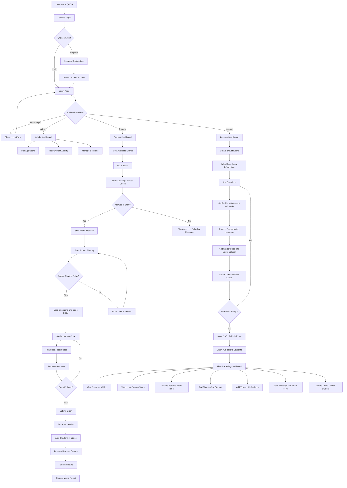
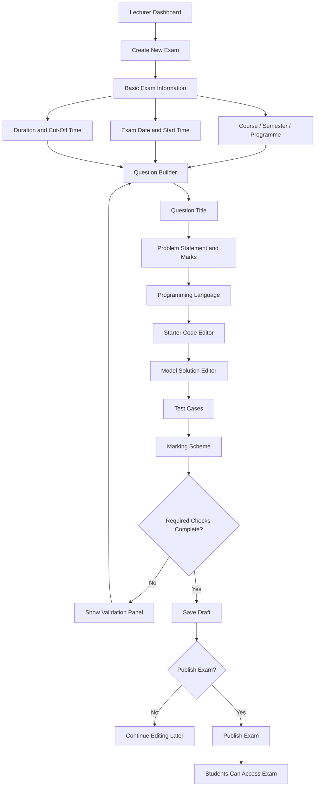
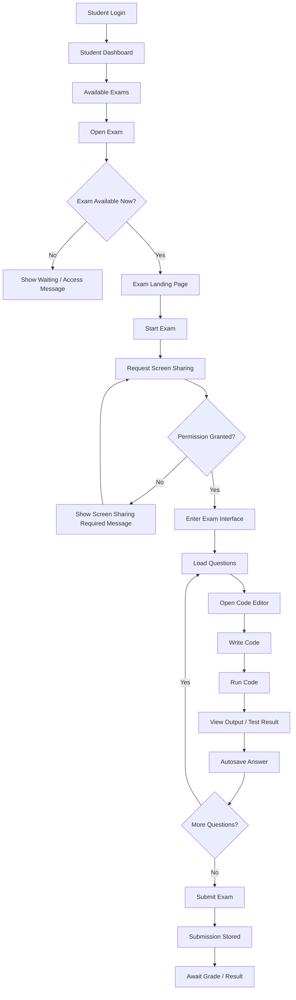
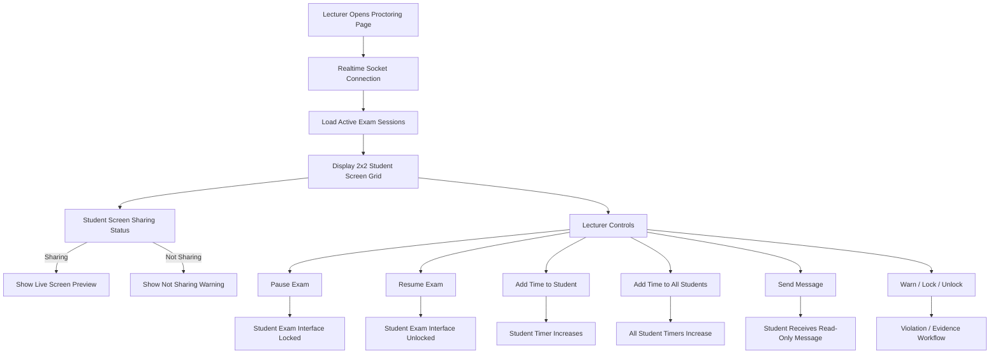
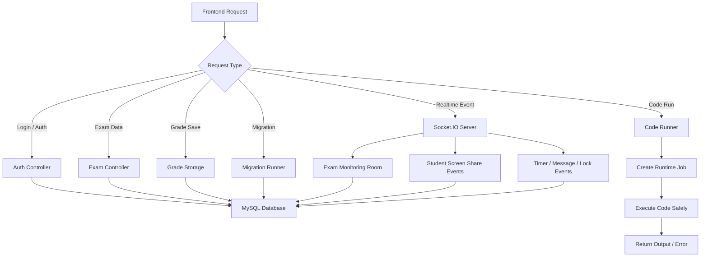

# QODA Project Flowchart

This flowchart summarizes the main QODA PU system flow from landing page to login, exam creation, live proctoring, student exam writing, grading, and result publishing.

## Main System Flow

## Lecturer Exam Creation Flow

## Student Exam Flow

## Live Proctoring and Exam Control Flow

## Backend Processing Flow

