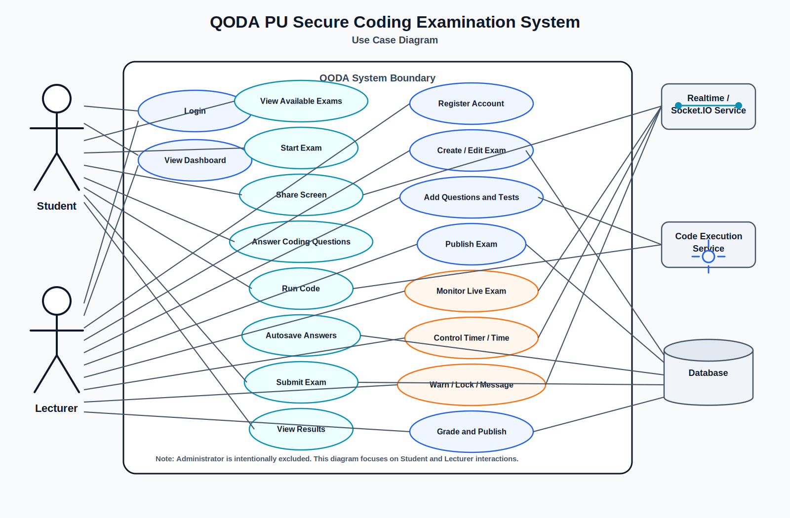

# QODA Use Case Diagram

This use case diagram shows the main QODA PU actors and system use cases.

There is no Administrator actor in this diagram. The main human actors are:

- Student
- Lecturer

The supporting system actors are:

- Realtime / Socket.IO Service
- Code Execution Service
- Database

## Diagram

## Use Case Summary

| Actor | Main Use Cases |
|---|---|
| Student | Login, view dashboard, view available exams, start exam, share screen, answer coding questions, run code, autosave answers, submit exam, view results |
| Lecturer | Register account, login, create or edit exam, add coding questions, add test cases, publish exam, monitor live exam, view screen share, pause or resume exam, add extra time, send live message, warn/lock/unlock student, grade submissions, publish results |
| Realtime / Socket.IO Service | Broadcast screen sharing, timer updates, lock/unlock actions, warnings, and live messages |
| Code Execution Service | Execute student code and validate test cases |
| Database | Store users, exams, questions, answers, sessions, grades, and results |
